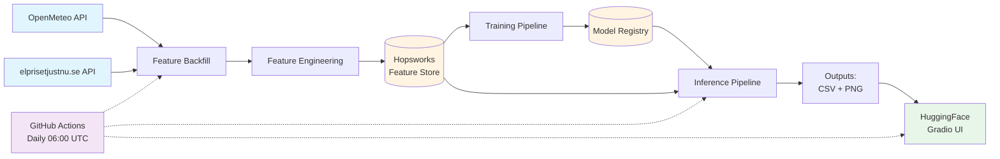

# ⚡ Electricity Price Predictor

An end-to-end ML system for predicting Swedish electricity prices in the Stockholm region (SE3). Combines weather data with historical electricity prices to generate 7-day forecasts, tracks prediction accuracy, and updates automatically via GitHub Actions.

**Educational project for Scalable Machine Learning course (ID2223) at KTH Royal Institute of Technology.**

**Authors:** Max Dougly, Erik Forsell

**Live Demo:** [HuggingFace Space](https://huggingface.co/spaces/eforse01/Electricity_price_predictor)

---

## 🏗️ System Architecture



---

## 🔗 Important Links

| Resource | URL |
|----------|-----|
| **Live App** | [HuggingFace Space](https://huggingface.co/spaces/eforse01/Electricity_price_predictor) |
| **Feature Store** | [Hopsworks Project](https://c.app.hopsworks.ai/p/1333397/view) |
| **Weather API** | [OpenMeteo](https://open-meteo.com/) |
| **Price API** | [elprisetjustnu.se](https://www.elprisetjustnu.se/api/v1/prices/) |

---

## 🧩 Components

### Data Sources
- **OpenMeteo API** - Historical & forecast weather data (temperature, wind, precipitation, solar radiation)
- **elprisetjustnu.se API** - Swedish electricity spot prices for SE3 region, updated daily at 13:00 CET

### Feature Pipeline (`pipelines/feature_backfill.py`)
Collects weather and price data, engineers 22 features including temporal patterns, lag features (1d, 7d), and rolling statistics. Saves to Hopsworks Feature Store or local Parquet files.

### Hopsworks Feature Store
Cloud-based feature store storing engineered features in `electricity_price` feature group (version 1). Project ID: 1333397.

### Training Pipeline (`pipelines/training_pipeline.py`)
Trains XGBoost regression model on historical features. Model achieves R² ~0.94 on test data.

### Inference Pipeline (`pipelines/inference_pipeline.py`)
Generates 7-day price forecasts, compares predictions with actual prices, exports CSV and PNG visualizations.

### Storage Factory (`functions/storage_factory.py`)
Unified interface supporting both local Parquet storage and Hopsworks Feature Store with the same API.

### HuggingFace Space
Interactive Gradio web UI displaying forecast charts and prediction accuracy tracking. Auto-updates daily.

---

## ⚙️ Automated Jobs & Routines

| Task | Schedule | Description |
|------|----------|-------------|
| **Feature Backfill** | Daily 06:00 UTC | Collects data from 9 days ago to 2 days ago, appends to Feature Store |
| **Inference** | Daily 06:00 UTC | Generates 7-day forecast, creates comparison charts |
| **Commit Outputs** | Daily 06:05 UTC | Commits CSV/PNG files to repository |
| **Upload to HuggingFace** | Daily 06:10 UTC | Syncs outputs folder to Space, Gradio auto-refreshes |

**Workflow:** `.github/workflows/electricity-price-daily.yml`

**Manual Trigger:** Available in GitHub Actions UI for immediate testing

---

## 🚀 Quick Start

### Installation

```bash
git clone https://github.com/maxdougly/sml_project.git
cd sml_project
pip install -r requirements.txt
```

### Local Mode (No Cloud Setup)

**1. Collect data:**
```bash
python pipelines/feature_backfill.py --mode local --start-date 2024-11-01
```

**2. Train model:**
```bash
python pipelines/training_pipeline.py --mode local
```

**3. Generate forecast:**
```bash
python pipelines/inference_pipeline.py --mode local --days 7
```

**Outputs:** `outputs/forecast_*.csv`, `outputs/forecast_*.png`, `outputs/comparison_timeseries.csv`

### Production Mode (Hopsworks)

Set API key and run:
```bash
export HOPSWORKS_API_KEY='your-key'
python pipelines/feature_backfill.py --mode production --start-date 2023-01-01
python pipelines/training_pipeline.py --mode production
python pipelines/inference_pipeline.py --mode production --days 7
```

**Mode auto-detection:** If `HOPSWORKS_API_KEY` is set, defaults to production; otherwise local.

### Test APIs

```bash
python tests/test_data_sources.py
```

---

## 📁 Repository Structure

```
├── pipelines/              # Feature backfill, training, inference
├── functions/              # Utilities (storage, data retrieval)
├── tests/                  # API tests
├── data/                   # Local storage (Parquet, models)
├── outputs/                # Forecasts and charts
└── .github/workflows/      # Daily automation
```

---

**Last Updated:** January 2026
