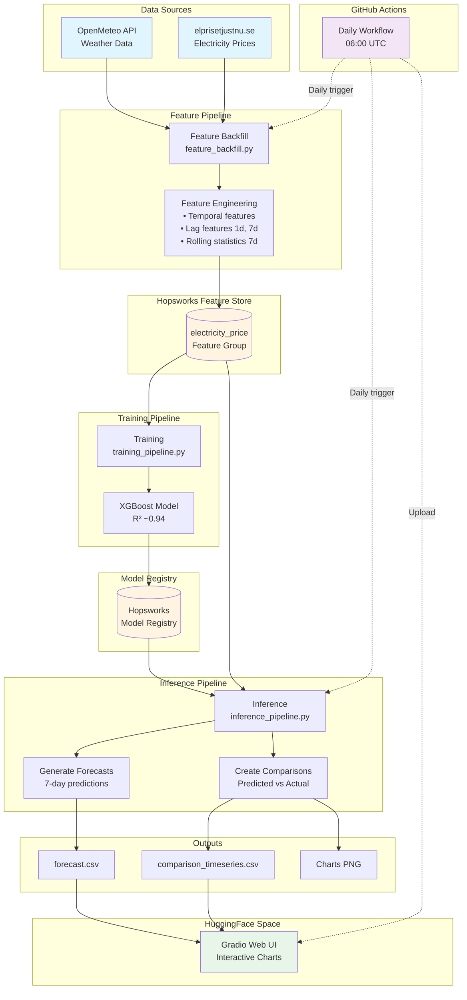

# ⚡ Electricity Price Predictor

An end-to-end ML system for predicting Swedish electricity prices in the Stockholm region (SE3). The system combines weather data with historical electricity prices to generate 7-day price forecasts, tracks prediction accuracy over time, and automatically updates daily via GitHub Actions.

**Live Demo:** [HuggingFace Space](https://huggingface.co/spaces/eforse01/Electricity_price_predictor)

---

## 🎯 What Does It Do?

This system:
- **Collects** weather and electricity price data daily from public APIs
- **Engineers** features using temporal patterns, lag features, and rolling statistics
- **Trains** an XGBoost regression model on historical data
- **Generates** 7-day electricity price forecasts
- **Tracks** prediction accuracy by comparing forecasts with actual prices
- **Visualizes** results in an interactive Gradio web interface
- **Runs automatically** every day at 06:00 UTC via GitHub Actions

---

## 🏗️ System Architecture



---

## 🔗 Important Links

| Resource | URL | Description |
|----------|-----|-------------|
| **Live App** | [HuggingFace Space](https://huggingface.co/spaces/eforse01/Electricity_price_predictor) | Interactive web UI with predictions |
| **Feature Store** | [Hopsworks Project](https://c.app.hopsworks.ai/p/1333397/view) | Feature Store & Model Registry |
| **Weather API** | [OpenMeteo](https://open-meteo.com/) | Historical & forecast weather data |
| **Price API** | [elprisetjustnu.se](https://www.elprisetjustnu.se/api/v1/prices/) | Swedish electricity prices (SE3) |

---

## 🧩 Components

### 1. Data Sources

#### OpenMeteo API
- **Purpose:** Fetch historical and forecast weather data
- **Features:** Temperature (mean/max/min), precipitation, wind speed, solar radiation
- **Update Frequency:** Real-time for forecasts, historical data always available
- **Cost:** Free, no API key required
- **Rate Limit:** 10,000 requests/day

#### elprisetjustnu.se API
- **Purpose:** Fetch Swedish electricity spot prices for SE3 (Stockholm) region
- **Data Format:** Hourly prices (SEK/kWh), aggregated to daily mean/min/max/std
- **Update Frequency:** Daily at 13:00 CET (prices for next day)
- **Cost:** Free, no API key required
- **Coverage:** Historical data available, updated daily

### 2. Feature Pipeline (`pipelines/feature_backfill.py`)

Collects raw data and engineers features for model training.

**What it does:**
- Fetches historical weather data from OpenMeteo
- Fetches electricity price data from elprisetjustnu.se
- Merges data on date
- Engineers 22 features:
  - **Temporal:** day_of_week, month, is_weekend, day_of_year
  - **Weather:** temp_squared, wind_temp_interaction
  - **Lag features:** price_lag_1d, price_lag_7d (yesterday, last week)
  - **Rolling stats:** price_rolling_mean_7d, price_rolling_std_7d
- Saves to Hopsworks Feature Store or local Parquet files

**Modes:**
- `--mode local`: Saves to `data/processed/electricity_price.parquet`
- `--mode production`: Saves to Hopsworks Feature Store

**Usage:**
```bash
python pipelines/feature_backfill.py \
  --mode production \
  --start-date 2023-01-01 \
  --end-date 2024-12-31
```

### 3. Hopsworks Feature Store

Cloud-based feature store for ML features and models.

**Components:**
- **Feature Group:** `electricity_price` (version 1) - stores engineered features
- **Model Registry:** Stores trained XGBoost models with versioning
- **Benefits:** Centralized feature storage, versioning, time-travel queries

**Configuration:**
- Project name: `electricity_price`
- Project ID: 1333397
- Authentication: API key via `HOPSWORKS_API_KEY` environment variable

### 4. Training Pipeline (`pipelines/training_pipeline.py`)

Trains XGBoost regression model on historical features.

**What it does:**
- Loads features from Hopsworks or local storage
- Splits data: 80% train, 20% test
- Trains XGBoost model with optimized hyperparameters
- Evaluates performance (R², RMSE, MAE)
- Saves model to Model Registry or local file

**Model Performance:**
- **R² Score:** ~0.94 (excellent)
- **RMSE:** ~0.12 SEK/kWh
- **MAE:** ~0.08 SEK/kWh

**Usage:**
```bash
python pipelines/training_pipeline.py --mode production
```

### 5. Inference Pipeline (`pipelines/inference_pipeline.py`)

Generates 7-day price forecasts and tracks accuracy.

**What it does:**
- Fetches latest weather forecasts (7 days ahead)
- Engineers features for forecast period
- Loads trained model from registry
- Generates predictions
- Compares predictions with actual prices (when available)
- Exports forecast CSV and comparison CSV
- Creates visualization charts

**Outputs:**
- `outputs/forecast_YYYYMMDD.csv` - 7-day forecast data
- `outputs/forecast_YYYYMMDD.png` - Forecast visualization
- `outputs/comparison_timeseries.csv` - Growing dataset of predictions vs actuals
- `outputs/predicted_vs_actual_YYYYMMDD.png` - Accuracy tracking chart

**Usage:**
```bash
python pipelines/inference_pipeline.py --mode production --days 7
```

### 6. Storage Factory (`functions/storage_factory.py`)

Unified interface for local and production storage.

**Purpose:** Allow same pipeline code to work with both local Parquet files and Hopsworks Feature Store

**Features:**
- Auto-detects mode based on `HOPSWORKS_API_KEY`
- Provides consistent API: `get_feature_store()`, `get_model_registry()`
- Switches between `LocalProject` and `HopsworksStorage` backends

### 7. HuggingFace Space

Interactive web UI built with Gradio.

**Features:**
- **Forecast Chart:** Shows next 7 days of predicted prices
- **Comparison Chart:** Tracks predicted vs actual prices over time
- **Metrics Display:** MAE, RMSE, prediction accuracy
- **Auto-updates:** GitHub Actions uploads new data daily

**How it works:**
1. GitHub Actions runs daily at 06:00 UTC
2. Generates new forecasts and comparisons
3. Uploads `outputs/` folder to HuggingFace Space
4. Gradio app automatically refreshes with new data

---

## ⚙️ Automated Jobs & Routines

### Daily GitHub Actions Workflow

**Trigger:** Every day at 06:00 UTC (07:00 CET / 08:00 CEST)

**Workflow:** `.github/workflows/electricity-price-daily.yml`

**Steps:**

1. **Feature Backfill (Step 1/4)**
   - Collects data from 9 days ago to 2 days ago
   - Ensures we have enough lag features (7-day window)
   - Appends new data to Feature Store

2. **Inference (Step 2/4)**
   - Generates 7-day forecast using latest weather data
   - Creates comparisons with actual prices (when available)
   - Exports CSV files and PNG charts

3. **Commit Outputs (Step 3/4)**
   - Commits generated files to repository
   - Includes: `outputs/*.csv`, `outputs/*.png`

4. **Upload to HuggingFace (Step 4/4)**
   - Uploads entire `outputs/` folder to HuggingFace Space
   - Gradio app automatically picks up new data
   - Chart updates within ~30 seconds

**Environment Variables Required:**
- `HOPSWORKS_API_KEY`: For accessing Feature Store
- `HF_TOKEN`: For uploading to HuggingFace Space

**Manual Trigger:**
You can also manually trigger the workflow from GitHub Actions UI for immediate testing.

### Data Update Schedule

| Task | Frequency | Time (UTC) | Notes |
|------|-----------|------------|-------|
| Weather forecast | Daily | 06:00 | Via OpenMeteo API |
| Electricity prices | Daily | 13:00 CET | elprisetjustnu.se updates |
| Feature backfill | Daily | 06:00 | GitHub Actions |
| Inference run | Daily | 06:00 | GitHub Actions |
| HuggingFace update | Daily | 06:05 | After inference completes |

---

## 🚀 Quick Start

### Prerequisites
- Python 3.9+ (tested on 3.9, 3.10, 3.11)
- pip package manager

### 1. Clone & Install

```bash
# Clone repository
git clone https://github.com/maxdougly/sml_project.git
cd sml_project

# Install dependencies
pip install -r requirements.txt
```

### 2. Test Data Sources

```bash
# Verify APIs are accessible
python tests/test_data_sources.py
```

Expected output:
```
✅ OpenMeteo API working
✅ elprisetjustnu.se API working
```

### 3. Run Local Pipeline

#### Step 1: Collect Historical Data
```bash
python pipelines/feature_backfill.py \
  --mode local \
  --start-date 2024-11-01 \
  --end-date 2024-12-31
```

This creates `data/processed/electricity_price.parquet` with engineered features.

#### Step 2: Train Model
```bash
python pipelines/training_pipeline.py --mode local
```

This creates `data/models/electricity_price_model.pkl`.

#### Step 3: Generate Forecast
```bash
python pipelines/inference_pipeline.py --mode local --days 7
```

This creates:
- `outputs/forecast_YYYYMMDD.csv` - 7-day predictions
- `outputs/forecast_YYYYMMDD.png` - Forecast chart
- `outputs/comparison_timeseries.csv` - Accuracy tracking (if actuals available)

### 4. View Results

```bash
# Open forecast chart
open outputs/forecast_*.png

# View forecast data
cat outputs/forecast_*.csv
```

### 5. (Optional) Production Mode with Hopsworks

```bash
# Set API key
export HOPSWORKS_API_KEY='your-key-here'

# Run pipelines in production mode
python pipelines/feature_backfill.py --mode production --start-date 2023-01-01
python pipelines/training_pipeline.py --mode production
python pipelines/inference_pipeline.py --mode production --days 7
```

---

## 📊 Understanding the Outputs

### Forecast Chart (`forecast_YYYYMMDD.png`)
- **X-axis:** Dates (next 7 days)
- **Y-axis:** Price in SEK/kWh
- **Line:** Predicted electricity prices
- **Purpose:** See upcoming week's price predictions

### Comparison Chart (`predicted_vs_actual_YYYYMMDD.png`)
- **Red line:** Predicted prices (made 1 day ahead)
- **Blue line:** Actual prices (from API)
- **Metrics:** MAE (Mean Absolute Error), RMSE (Root Mean Square Error)
- **Purpose:** Track model accuracy over time

### Comparison Timeseries (`comparison_timeseries.csv`)
```csv
target_date,predicted_price,actual_price,prediction_date
2025-12-30,0.1287665,0.5048838541666667,2025-12-29
2025-12-31,0.15873438,0.8352080208333333,2025-12-29
```
- **target_date:** Date being predicted
- **predicted_price:** Model's prediction (SEK/kWh)
- **actual_price:** Real price from API (SEK/kWh)
- **prediction_date:** When the prediction was made

---

## 🔧 Configuration & Modes

### Local Mode (`--mode local`)
✅ **Best for:** Development, testing, learning
- No cloud account needed
- Fast iteration
- Data stored in `data/processed/` (Parquet files)
- Models stored in `data/models/` (pickle files)
- Complete feature parity with production mode

### Production Mode (`--mode production`)
✅ **Best for:** Production deployment, team collaboration
- Requires Hopsworks account (free tier available)
- Centralized feature store
- Model versioning & registry
- Scalable for larger datasets
- Team can share features & models

### Auto-Detection
If you don't specify `--mode`, the system auto-detects:
- `HOPSWORKS_API_KEY` environment variable set → **production mode**
- Otherwise → **local mode**

---

## 🧪 Testing & Development

### Run Tests
```bash
# Test data sources
python tests/test_data_sources.py
```

### Quick Test (3 days of data)
```bash
# Faster testing with minimal data
python pipelines/feature_backfill.py --mode local --start-date 2024-12-26 --end-date 2024-12-28
python pipelines/training_pipeline.py --mode local
python pipelines/inference_pipeline.py --mode local --days 3
```

### Development Workflow
1. Make code changes
2. Run local mode pipeline
3. Check outputs in `outputs/` and `data/`
4. Commit changes
5. Push to GitHub
6. GitHub Actions runs automatically

---

## 🔍 Troubleshooting

### Import Errors
**Error:** `ModuleNotFoundError: No module named 'functions'`

**Solution:** Always run from project root:
```bash
cd ~/electricity-price-predictor
python pipelines/training_pipeline.py
```

### API Errors

**OpenMeteo timeout:**
- Rate limit: 10,000 requests/day
- Solution: Wait 1 minute between large requests

**elprisetjustnu.se 404:**
- Prices update at 13:00 CET daily
- Solution: Data for "tomorrow" available after 13:00 today

### Model Errors

**"Model not found":**
- Run training pipeline first: `python pipelines/training_pipeline.py --mode local`

**Low R² score (<0.7):**
- Need more historical data (minimum 30 days recommended)
- Run feature_backfill.py with larger date range

### Hopsworks Errors

**"Invalid API key":**
```bash
export HOPSWORKS_API_KEY='your-key'
# Or add to .env file
```

**"Feature Group not found":**
- Run feature_backfill.py first to create feature group

**"Wrong project connection":**
- Make sure `storage_factory.py` specifies `project='electricity_price'`

### GitHub Actions Failures

**"ModuleNotFoundError: requests_cache":**
- Check `requirements.txt` includes `requests-cache` and `retry-requests`

**"HTTP 401 on Hopsworks":**
- Set `HOPSWORKS_API_KEY` in GitHub repository secrets

**"HTTP 401 on HuggingFace":**
- Set `HF_TOKEN` in GitHub repository secrets with write access

---

## 📁 Project Structure

```
electricity-price-predictor/
├── pipelines/                      # Main pipeline scripts
│   ├── feature_backfill.py        # Data collection & feature engineering
│   ├── training_pipeline.py       # Model training
│   └── inference_pipeline.py      # Forecast generation & comparison
│
├── functions/                      # Utility modules
│   ├── storage_factory.py         # Storage abstraction (local/cloud)
│   ├── local_storage.py           # Local Parquet storage backend
│   ├── util.py                    # Data retrieval (APIs)
│   └── electricity_data_retrieval.py
│
├── tests/                          # Test suite
│   └── test_data_sources.py      # API connectivity tests
│
├── data/                           # Local mode data storage
│   ├── processed/                 # Feature data (Parquet)
│   └── models/                    # Trained models (pickle)
│
├── outputs/                        # Generated forecasts & charts
│   ├── forecast_*.csv            # Prediction data
│   ├── forecast_*.png            # Forecast visualizations
│   ├── comparison_timeseries.csv  # Accuracy tracking
│   └── predicted_vs_actual_*.png # Comparison charts
│
├── .github/workflows/             # GitHub Actions
│   └── electricity-price-daily.yml
│
├── docs/                          # Documentation
├── requirements.txt               # Python dependencies
└── README.md                      # This file
```

---

## 🤝 Contributing

This is an educational project for the MLOps course (ID2223) at KTH Royal Institute of Technology.

**Authors:** maxdougly, E4Sell, ZwiZell

**Course:** ID2223 Scalable Machine Learning and Deep Learning

---

## 📝 License

Educational project - see course guidelines.

---

## 📞 Support

For issues or questions:
1. Check the [Troubleshooting](#-troubleshooting) section
2. Review [documentation](docs/)
3. Create an issue on GitHub

---

**Last Updated:** January 2026
**Model Version:** 1.0
**Feature Group Version:** 1
