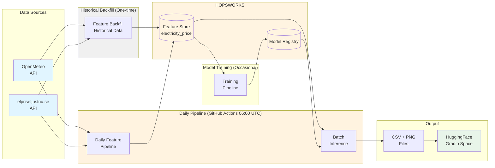

# Electricity Price Predictor

This repository contains an end-to-end machine learning project in the Scalable Machine Learning course (ID2223). The project combines weather data with historical electricity prices to produce 7-day forecasts for the Stockholm region (SE3) and includes utilities for data collection, model training (XGBoost or LSTM), and daily batch inference with output visualization.

Authors: Max Dougly, Erik Forsell

Live demo: [HuggingFace Space](https://huggingface.co/spaces/eforse01/Electricity_price_predictor)

---

## System architecture



---

## Important links

| Resource | URL |
|----------|-----|
| Live app | [HuggingFace Space](https://huggingface.co/spaces/eforse01/Electricity_price_predictor) |
| Feature store | [Hopsworks Project](https://c.app.hopsworks.ai/p/1333397/view) |
| Weather API | [OpenMeteo](https://open-meteo.com/) |
| Price API | [elprisetjustnu.se](https://www.elprisetjustnu.se/api/v1/prices/) |

---

## Components

### Data sources
- OpenMeteo API: Historical and forecast weather data (temperature, wind, precipitation, solar radiation).
- elprisetjustnu.se API: Swedish electricity spot prices for the SE3 region.

### Feature pipeline (pipelines/feature_backfill.py)
Collects weather and price data, engineers features including temporal patterns, lag features (1-day, 7-day) and rolling statistics, and writes results to the feature store or local storage.

### Feature store
Hopsworks feature store storing engineered features in the `electricity_price` feature group (version 1). Project ID: 1333397.

### Training pipeline (pipelines/training_pipeline.py)
Trains models (XGBoost or LSTM) using historical features extracted from the feature store or local data.

### Inference pipeline (pipelines/inference_pipeline.py)
Generates 7-day price forecasts, exports CSV and PNG outputs, and appends predictions to a tracking file for later comparison with actuals.

### Storage factory (functions/storage_factory.py)
Provides a unified interface for local Parquet storage and Hopsworks Feature Store access.

### HuggingFace Space
A Gradio web UI that displays forecast charts and prediction tracking. Outputs are synchronized to the Space on a daily schedule.

---

## Automated jobs and routines

| Task | Schedule | Description |
|------|----------|-------------|
| Feature backfill | Daily | Collects data from 9 days ago to 2 days ago and appends to feature store. |
| Inference | Daily | Generates 7-day forecast and comparison charts. |
| Commit outputs | Daily | Commits CSV and PNG files to repository. |
| Upload to HuggingFace | Daily | Syncs outputs folder to the HuggingFace Space. |

Workflow configuration: `.github/workflows/electricity-price-daily.yml`

A manual trigger is available in the GitHub Actions UI.

---

## Quick start

A short quick start guide, the commands below are the minimum necessary to run the project in local mode.

### Installation

```bash
git clone https://github.com/E4Sell/sml_project.git
cd sml_project
pip install -r requirements.txt
```

### Local run (minimal)

```bash
# Collect recent data (local mode)
python pipelines/feature_backfill.py --mode local --start-date 2024-11-01

# Train a model (default is XGBoost; add --model-type lstm to train LSTM)
python pipelines/training_pipeline.py --mode local

# Generate a 7-day forecast
python pipelines/inference_pipeline.py --mode local --days 7
```

---

## Repository structure

```
├── pipelines/              # Feature backfill, training, inference
├── functions/              # Utilities (storage, data retrieval)
├── tests/                  # Tests
├── data/                   # Local storage (Parquet, models)
├── outputs/                # Forecasts and charts
└── .github/workflows/      # Daily automation
```
